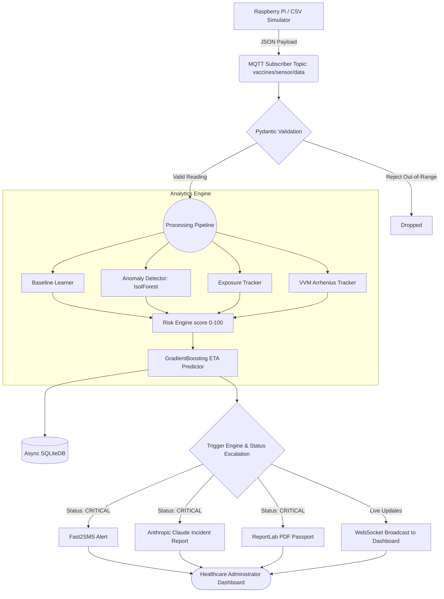
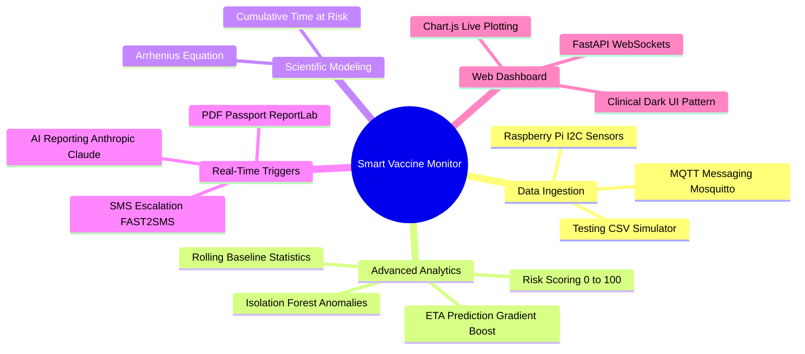

<div align="center">
  
  
  <h1>Vaccine Cold-Chain Surveillance System</h1>
  <p><b>Real-time IoT + AI solution preventing critical global health risks with actionable data and automated compliance.</b></p>
</div>

<br>

## 🌍 The Problem & The Impact

**The World Health Organization (WHO) estimates that up to 50% of vaccines are wasted globally, largely due to temperature excursions during storage and transport.** 

This system prevents this wastage by tracking cumulative heat damage via the **Arrhenius Equation (VVM model)** and detecting anomalies using Machine Learning algorithms (Isolation Forest). By actively estimating Time-To-Critical failure, it fundamentally changes vaccine transport from reactive reporting to **proactive preservation**.

> **Impact**: Real-time surveillance saves millions of dollars in biopharma logistics and directly impacts global public health by guaranteeing the efficacy of life-saving vaccines at their final mile.

---

## 🏗 System Architecture Flowchart



---

## 🧠 System Mind Map



---

## 💻 Technical Stack

### Software Engineering
| Technology | Purpose | Reason Chosen |
|---|---|---|
| **FastAPI** | Backend Framework | Native async support, websockets, blazing fast. |
| **Paho-MQTT** | Message Broker | Industry standard for reliable IoT hardware transmission. |
| **SQLAlchemy 2 / aiosqlite** | Async ORM Stack | Non-blocking database calls perfect for Raspberry Pi. |
| **Scikit-Learn** | Local ML Modeling | Lightweight decision trees rather than heavy neural nets. |
| **Chart.js** | Frontend UI | CDN ready, ultra-smooth responsive line charts. |
| **Anthropic Claude AI** | Generative Reporting | Generates human-aligned compliance documents instantly. |
| **ReportLab** | Document Generation | Zero dependency pure Python PDF creation. |

### 🛠 Hardware Components
* **Raspberry Pi 4 Model B**: Serves as the localized edge node and initial data hub.
* **DHT22 Temperature & Humidity Sensor**: High accuracy ambient environmental monitoring.
* **DS18B20 Waterproof Sensor**: For internal cryogenic or standard medical refrigeration monitoring.
* **4G LTE Cellular Module (Optional)**: Ensures continuous telemetry transmission in poor WiFi environments.
* **Battery Backup UPS**: Guarantees up-time tracking across brief facility power outages.

---

## 🚀 Setup & Installation

### 1. Prerequisites
- Python 3.10+
- `Mosquitto` MQTT broker installed natively (for hardware mode).

### 2. General Setup
```bash
git clone https://github.com/rohan-chand-m-01/Lorem-Epsum
cd Lorem-Epsum

python -m venv venv
# Windows:
venv\Scripts\activate
# Mac/Linux:
source venv/bin/activate

pip install -r requirements.txt
cp .env.example .env
```

### 3. Environment Variables
Add the necessary variables inside the `.env` file:
* Set `SIMULATION_MODE=true` to skip physical sensors during testing.
* Set `FAST2SMS_API_KEY` for alerts.
* Set `ANTHROPIC_API_KEY` for advanced AI reporting over standard static reporting.

### 4. Running the System
```bash
uvicorn main:app --reload
```
Navigate to `http://localhost:8000` to observe the beautiful dark-medical dashboard!

---
<div align="center">
<i>Built with ❤️ for Global Health Initiative Solutions</i>
</div>
